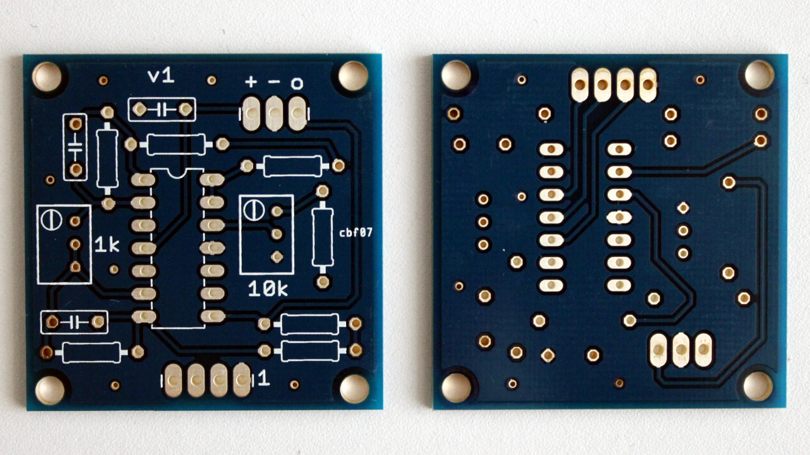

PCB MPX20xx
===========

This is a PCB for the [water tank depth
sensor](http://www.practicalarduino.com/projects/water-tank-depth-sensor)
project featured in the [Practical
Arduino](http://www.practicalarduino.com) book.

From the [MPX2010
datasheet](http://www.freescale.com/files/sensors/doc/data_sheet/MPX2010.pdf):

>The MPX2010 series silicon piezoresistive pressure sensors provide a
>very accurate and linear voltage output directly proportional to the
>applied pressure. These sensors house a single monolithic silicon die
>with the strain gauge and thin film resistor network integrated. The
>sensor is laser trimmed for precise span, offset calibration and
>temperature compensation.

The MPX2010 can mesaure up to 10 kPa (in water depth equals 10 meters)
and there are other MPX20xx sensor like the
[MPX2050](http://cache.freescale.com/files/sensors/doc/data_sheet/MPX2050.pdf)
that can mesaure up to 50 kPa (about 50 meters depth).

The [mpx20xx](mpx20xx) project was done in [CadSoft
EAGLE](http://www.cadsoft.de/eagle-pcb-design-software/) 7.1.0.

Schematic
---------

PCB
---

**Artwork**

**Manufactured**

Author
------

Manuel Rábade <[manuel@rabade.net](mailto:manuel@rabade.net)>

License
-------

This work is licensed under a [Creative Commons Attribution 4.0
International License](http://creativecommons.org/licenses/by/4.0/).
